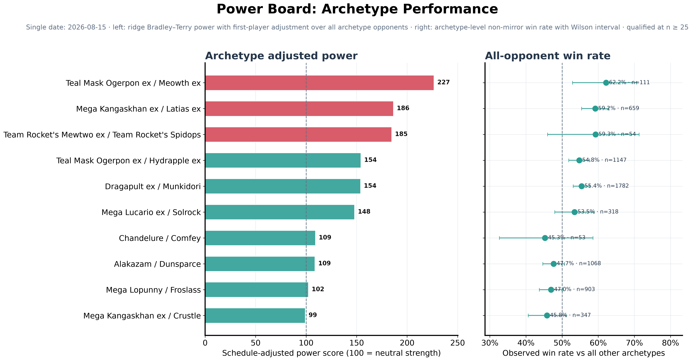

# PokéMeta · Pokémon TCG AI Battle Meta Evaluation

**PokéMeta** is an independent, static meta-analysis dashboard for the [Pokémon TCG AI Battle Challenge Simulation](https://www.kaggle.com/competitions/pokemon-tcg-ai-battle/overview) on Kaggle. It turns completed battle episodes into daily and rolling-window views of deck usage, performance, matchups, and counters.

[Open the live dashboard](https://zrwrz.github.io/pokemon-challenge-meta-analysis/) · [View the Kaggle competition](https://www.kaggle.com/competitions/pokemon-tcg-ai-battle/overview) · [Read the simulator API documentation](https://matsuoinstitute.github.io/cabt/)

> This is a community research and visualization project. It is not the official Kaggle evaluation service, leaderboard, or skill-rating implementation.



## What the dashboard shows

PokéMeta provides two complementary views:

- **Daily reports** capture the field on a single date.
- **Cumulative reports** aggregate a date range to reveal broader trends and more stable matchup patterns.

Each report answers a different question:

| Report | What it helps you understand |
| --- | --- |
| **Power Board** | Which archetypes combine strong estimated performance with reliable sample sizes? |
| **Matchup Matrix** | Where do the leading archetypes gain or lose head-to-head advantage? |
| **Meta Positioning** | How do popularity, adjusted strength, and the surrounding field interact? |
| **Best Counters** | Which decks perform well into the most-used archetypes? |
| **Usage Trend** | How does archetype representation change across a cumulative window? |

The web interface includes date and range selection, daily/cumulative mode switching, responsive layouts, and full-size report viewing.

## Evaluation context

Kaggle evaluates submitted agents through ongoing ladder episodes against agents with similar estimated skill. PokéMeta looks at those battle outcomes from a **deck-metagame** perspective rather than reproducing the official submission rating.

Keep the following limitations in mind when interpreting the figures:

- observed win rates and matchup rates are not the official Kaggle Skill Rating;
- ladder matchmaking, agent updates, deck choice, and first-player effects can introduce selection bias;
- small samples can produce unstable estimates, especially for rare archetypes and specific matchups;
- the metagame changes over time, so daily reports are snapshots rather than permanent rankings;
- draws, incomplete games, mirror matches, and low-sample groups may be handled differently across metrics by the upstream analysis pipeline.

Use the dashboard as a scouting and research aid, then validate conclusions with local simulation and agent-level testing.

## Repository scope

This repository contains the publication layer of the project:

```text
.
├── meta-analysis/
│   ├── YYYY-MM-DD/figures/                 # Daily report images
│   └── YYYY-MM-DD_to_YYYY-MM-DD/figures/  # Cumulative report images
├── scripts/
│   ├── build-site.mjs                      # Builds the gallery and manifest
│   └── serve.mjs                           # Serves the local preview
├── app.js                                  # Gallery behavior
├── index.html                              # Static application shell
├── styles.css                              # Responsive presentation
└── gallery-manifest.json                   # Published report index
```

Raw episode logs, private submissions, intermediate tables, and the upstream statistical pipeline are not published here. The tracked archive is intentionally limited to the static site and rendered PNG reports.

## Run locally

### Requirements

- [Node.js](https://nodejs.org/) 22 or newer
- No third-party npm packages are currently required

Build the static site:

```bash
npm run build
```

Start a local preview:

```bash
npm run dev
```

Then open <http://127.0.0.1:4173/>. The generated site is written to `dist/`, which is excluded from version control.

## Publish a new report

### 1. Add the figures

For a daily report, use:

```text
meta-analysis/YYYY-MM-DD/figures/
├── power_board_YYYY-MM-DD.png
├── matchup_YYYY-MM-DD.png
├── meta_positioning_YYYY-MM-DD.png
└── best_counters_YYYY-MM-DD.png
```

For a cumulative report, use:

```text
meta-analysis/YYYY-MM-DD_to_YYYY-MM-DD/figures/
├── power_board_cumulative.png
├── matchup_overall.png
├── meta_positioning_cumulative.png
├── best_counters_cumulative.png
└── usage_trend.png
```

Directory names must follow the exact ISO date formats shown above. The build script discovers PNG files by filename prefix and orders recognized report types automatically.

### 2. Build and verify

```bash
npm run build
npm run dev
```

Check both report modes, the date selector, image loading, and the full-size viewer before publishing.

### 3. Commit and push

```bash
git add meta-analysis/YYYY-MM-DD/figures gallery-manifest.json
git commit -m "add meta report for YYYY-MM-DD"
git push origin main
```

For a cumulative report, replace the daily path with the matching date-range directory. If report figures are pushed without a rebuilt manifest, the GitHub Actions workflow regenerates `gallery-manifest.json` automatically.

## How the site is built

`scripts/build-site.mjs` scans the report archive, copies the recognized figures into `dist/`, and generates two data files:

- `dist/site-data.json` for the bundled static preview;
- `gallery-manifest.json` for remote report discovery.

The browser first requests the published manifest from GitHub and falls back to the bundled site data when the remote manifest is unavailable. This keeps local previews usable while allowing the live archive to discover newly published figures.

## Related resources

- [Competition overview and evaluation](https://www.kaggle.com/competitions/pokemon-tcg-ai-battle/overview)
- [Competition data](https://www.kaggle.com/competitions/pokemon-tcg-ai-battle/data)
- [cabt simulator API](https://matsuoinstitute.github.io/cabt/)
- [Kaggle Environments](https://github.com/Kaggle/kaggle-environments)

## Disclaimer

PokéMeta is an independent research project and is not affiliated with or endorsed by Kaggle, The Pokémon Company, Nintendo, Creatures, or GAME FREAK. Pokémon and related marks belong to their respective owners.
